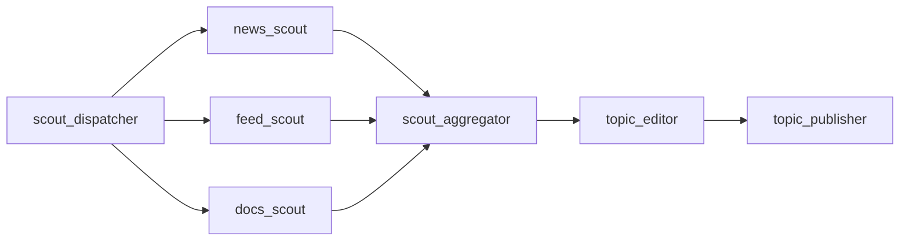
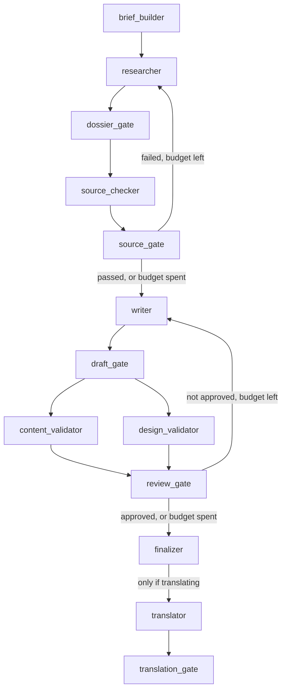

# How it works

Every stage, in order, with the decisions each one makes and the reasoning behind
how it was built. This is the document to read before changing anything.

- [The shape of the thing](#the-shape-of-the-thing)
- [Why typed objects, not prose](#why-typed-objects-not-prose)
- [Workflow 1 — topic discovery](#workflow-1--topic-discovery)
- [Workflow 2 — writing a post](#workflow-2--writing-a-post)
- [The source loop](#the-source-loop)
- [The revision loop](#the-revision-loop)
- [Cover art](#cover-art)
- [Publishing to WordPress](#publishing-to-wordpress)
- [Translation](#translation)
- [The tools agents can call](#the-tools-agents-can-call)
- [Where state lives](#where-state-lives)
- [The server](#the-server)
- [Testing without Azure](#testing-without-azure)

---

## The shape of the thing

Ten agents, two workflow graphs, one non-agent stage (cover art), and a publisher.

```
                        ┌──────────────────┐
   ppn suggest ────────▶│ topic discovery  │────▶ topics/suggestions-<date>.json
                        └──────────────────┘
                                 │  (you pick one)
                                 ▼
                        ┌──────────────────┐
   ppn write   ────────▶│  post pipeline   │────▶ drafts/  +  WordPress draft
                        └──────────────────┘
```

Orchestration is **Microsoft Agent Framework** (`agent_framework` 1.12+). The unit
of composition is a `Workflow` built from `Executor` nodes and edges. Two kinds of
node appear in these graphs:

- **`AgentExecutor`** — wraps an LLM agent. Receives an `AgentExecutorRequest`,
  returns an `AgentExecutorResponse`.
- **Custom `Executor` subclasses** — plain Python. These are the *gates*: they
  parse the agent's output into a typed object, decide where the run goes next, and
  own every loop condition in the system.

That split is deliberate. **No routing decision is made by a model.** The agents
produce judgements; the gates act on them. A gate is a `@handler` method you can
read, test and set a breakpoint in.

---

## Why typed objects, not prose

Every agent is bound to a Pydantic model through `response_format`:

```python
Agent(
    name="researcher",
    chat_client=clients.reasoning,
    instructions=researcher_instructions(...),
    tools=_searchable(tools.RESEARCHER_TOOLS, clients.reasoning),
    default_options=_opts(ResearchDossier),   # ← response_format
)
```

The service is then responsible for producing JSON that validates against the
schema. The gate calls `parse_model(response, ResearchDossier)` and gets an object
with `.claims`, `.citations`, `.open_questions`. Nothing downstream does regex
archaeology on a wall of markdown.

The models live in `models.py`. The important ones:

| Model | Produced by | Carries |
|---|---|---|
| `ScoutReport` | each scout | `items: list[SignalItem]`, `notes` |
| `TopicSuggestionSet` | Topic Editor | `suggestions`, `discarded` |
| `ResearchDossier` | Researcher | `claims`, `citations`, `examples`, `gotchas`, `limits`, `open_questions`, `suggested_outline` |
| `SourceVerdict` | Source Checker | `passed`, `average_trust`, `fabricated_urls`, `contradictions`, `findings`, `instructions_for_researcher` |
| `Draft` | Writer / Translator | `markdown`, `title`, `slug`, `meta_description`, `tags`, `cover_concept`, `revision`, `changelog` |
| `ValidationReport` | each Validator | `score`, `passed`, `findings: list[RuleFinding]`, `strengths` |
| `ReviewOutcome` | `ReviewGate` | aggregate of the above plus the source verdict |
| `PostPackage` | `Finalizer` | everything, serialised to `.package.json` |

A `Claim` carries `criticality` (`critical` / `supporting` / `colour`),
`citation_ids` and a `caveat`. That structure is what makes the Source Checker
possible at all — it can walk the critical claims and demand corroboration for each
one specifically, rather than judging a blob of text.

### Temperature, and a production failure

`_opts()` builds the options dict:

```python
def _opts(response_format, temperature=None):
    options = {"response_format": response_format}
    if temperature is not None and get_settings().foundry.supports_temperature:
        options["temperature"] = temperature
    return options
```

Only four agents ask for a temperature at all: Writer `0.7`, both Validators `0.2`,
Translator `0.3`. The scouts, Topic Editor, Researcher and Source Checker do not —
their job is retrieval and judgement, not variety.

The guard exists because reasoning models reject the parameter outright:

```
BadRequestError: Unsupported parameter: 'temperature' is not supported with this model
```

That error killed a real run six minutes in, *after* research had completed
successfully, because the Writer was the first agent to request a temperature.
`supports_temperature` now infers from the model name (`gpt-5`, `gpt5`, `o1`, `o3`,
`o4` prefixes → unsupported) and `ppn preflight` verifies the inference against the
live service in about two seconds. `FOUNDRY_TEMPERATURE_SUPPORT=true|false` pins it
if the heuristic is ever wrong.

---

## Workflow 1 — topic discovery

`build_topic_discovery_workflow()` in `workflows.py`. Entry point:
`scout_dispatcher`.



### `scout_dispatcher` → the three scouts

`ScoutDispatcher` builds one prompt listing the watch-area ids from
`config/topics.yaml` and fans it out to all three scouts, which run **concurrently**.
Each is a different lens on the same question, and each is blind to what the others
find:

- **News Scout** (`web_search`, `fetch_page`, `search_existing_posts`) — one search
  per watch area, restricted to that area's `freshness_days` window. Fetches
  anything substantive before reporting it. Capped at 4 items per area, 15 total.
- **Feed Scout** (`read_feeds`, `fetch_page`, `search_existing_posts`) — reads the
  curated feeds in `config/sources.yaml`, once for the official tier and once for
  the community tiers, then fetches the 5–8 most substantive entries. Prefers
  release-plan and product-blog entries that describe a concrete change.
- **Docs Scout** (`search_microsoft_learn`, `fetch_page`, `search_existing_posts`) —
  looks for docs updated in the last 60 days, pages about limits, quotas, throttling
  and licensing, and preview-vs-GA flags. Its prompt calls it "the counterweight to
  hype": its job is documented reality, including the quiet limitations, not
  announcements.

All three run on the **fast** model tier (`FOUNDRY_MODEL_FAST`). They make many
cheap calls; the reasoning happens later.

Every scout is forbidden from inventing URLs, from reporting anything already
covered on the blog (checked live via `search_existing_posts`), and from writing
anything resembling a post. Each item needs a one-sentence *why it matters* and a
`watch_area` id.

### `scout_aggregator`

`ScoutAggregator` is a fan-in node. It parses each `ScoutReport` and wraps it as
`<scout name="...">…json…</scout>`. A report that fails to parse is passed through
as raw text with `parse_error="true"` rather than being dropped — a scout that
produced good findings in a bad envelope should not silently vanish.

### `topic_editor`

`TopicSuggestionSet`, on the reasoning tier, with only `search_existing_posts` and
`today`. No web search: everything it needs is in front of it. Its method, as
instructed:

1. Cluster overlapping signals into one topic.
2. Kill anything that is just news unless it solves a reader problem.
3. Cross-check each idea against the blog, recording overlap in `duplicate_risk`.
4. Assign a `post_format` and an effort rating.
5. Score `0.4 × timeliness + 0.35 × audience_fit + 0.25 × novelty`, adjusted down
   for high effort and duplicate risk, and weighted by the watch area's `weight`.
6. Write `key_questions` that are specific and answerable — they become the
   research brief.

Returns exactly `topics.suggestions_per_run` suggestions (default 6), best first,
plus a `discarded` list with half-sentence reasons. The discard list matters: it is
how you tune the watch areas without re-running discovery.

### `topic_publisher`

Writes `topics/suggestions-<date>.json` and a human-readable `.md` beside it, then
yields the `TopicSuggestionSet` as the workflow output. The markdown version prints
the exact `ppn write --topic … --index N` command for each suggestion.

---

## Workflow 2 — writing a post

`build_post_workflow()`. Entry point: `brief_builder` (or `dossier_entry` when
resuming).



`max_iterations` for the graph is computed, not guessed:
`40 + 10 × (max_source_rounds + max_revision_rounds)`. Raising a loop budget in
`.env` raises the graph budget with it.

### `brief_builder`

Turns the chosen `TopicSuggestion` into a `<research_brief>` — the angle, the
problem statement, the `key_questions`, the seed sources — and hands it to the
Researcher. It also stores the topic on the shared `RunState`.

### `researcher`

The most tool-heavy agent: Microsoft Learn search, web search, page fetching, feed
reading, blog search, and a trust-classification tool.

Its instructions are specific about method, and the specificity is what makes the
Source Checker's job possible:

- Microsoft Learn **first**, for documented behaviour. Official docs outrank
  everything.
- Web search for practitioner reality — what actually happens in a tenant.
- **Fetch every source before citing it.** "If the fetch fails, the source does not
  exist for your purposes."
- Run `assess_source_trust` on the URL list; replace anything `blocked` or
  `unknown` unless it is corroborated.
- Capture the **exact supporting sentence** in each citation's `excerpt`.

Hard rules: every claim gets an id (`C1`, `C2`…) and cites citation ids. Any claim
about limits, quotas, pricing, licensing or GA/preview status is `critical`, needs
at least `min_sources_per_critical_claim` independent sources (default 2), and at
least one of them must be official Microsoft. Anything unverifiable goes to
`open_questions` — never guessed. Version, region, preview and tenant caveats are
recorded explicitly.

It never writes the post.

### `dossier_gate`

Parses the `ResearchDossier` and **immediately writes it to `research/`**, before
sending anything downstream.

This is the single most valuable line in the file. Research is the expensive stage —
dozens of fetches, minutes of wall clock — and everything after it can fail. Saving
here means a failure at the Writer costs you the Writer, not the whole run. It is
what makes `ppn write --dossier …` possible.

---

## The source loop

The Source Checker is **adversarial by construction**. Its prompt opens by telling
it to assume the research contains at least one fabricated URL, one overstated
claim, and one source that does not say what it is quoted as saying.

Its procedure, in order:

1. `check_url_reachable` on **every** dossier URL, in one call. Any URL that does
   not resolve is a blocker.
2. `assess_source_trust` on the same list. Any `blocked`-tier domain is a hard
   fail. Compute the average trust score.
3. For every `critical` claim, `fetch_page` its cited sources and **confirm the
   excerpt actually appears**. A mismatch is a blocker, with the evidence recorded.
4. For limits, pricing, licensing and GA/preview claims, require at least one
   official Microsoft source. Missing one is
   `version_or_pricing_claim_without_official_source` — a hard fail.
5. **Actively search for contradictions** via Microsoft Learn on the critical
   claims. Being contradicted by official docs is a hard fail.
6. Check source recency for news-like claims against
   `max_source_age_days_for_news` (default 180).

`passed` is true only with zero blockers, no hard-fail condition, **and**
`average_trust >= min_average_trust` (default 3.5).

### The gate

`SourceGate.route()` owns the loop:

```python
if not verdict.passed and self.state.source_round < max_rounds:
    self.state.source_round += 1
    → back to the researcher, with researcher_revision_instructions() + the verdict
else:
    → on to the writer
```

`max_rounds` is `PPN_MAX_SOURCE_ROUNDS`, default 2.

Two design choices worth noting:

**A failing verdict does not block the pipeline.** Once the budget is spent, the
run continues — but the Writer receives an `<unresolved_source_issues>` block
naming exactly what could not be verified, and the caveats propagate into the
prose. A post that says "as of July 2026, in my tenant" is more useful than no post.

**The revision is surgical.** `researcher_revision_instructions()` tells the
Researcher to fix only what was flagged: replace fabricated or unreachable URLs,
add corroborating official sources for the named claims, remove or downgrade
unsupportable claims — and *not* to expand scope. Then return the complete
corrected dossier.

---

## The revision loop

### `writer`

The Writer has almost no tools — `search_existing_posts` and `today`. It writes
"from the researcher's dossier, and from nothing else." Everything it might have
looked up has already been fetched, verified and structured.

It enforces one fixed post shape, driven entirely by
`blog_profile.yaml → structure`:

1. One `# H1`, 45–65 characters, containing the primary keyword.
2. Exactly `opening_paragraphs` (2) opening paragraphs — problem, then payoff. No
   TL;DR block.
3. `## Contents` — bullet list of anchor links, one per following H2, in order.
4. Between `min_sections` and `max_sections` (8–11) `##` sections. **Never H3.**
   Generic headings (Introduction, Background, Overview, Summary) are banned.
5. A mandatory penultimate section — `critical_section_heading`, default *"What to
   watch carefully"* — covering real risks, maturity, availability, and what can
   break.
6. A closing section from `closing_headings` (*Conclusion* or *My take*) — an
   opinion and a recommendation, not a recap.
7. `## Sources` — markdown links, document title only, no dates, no numbering.

**No inline citations anywhere.** That is a house-style decision, and it puts the
whole burden of factual integrity on the dossier and the validators. Every factual
statement must still trace to a dossier claim; dossier caveats must survive into
prose.

On revision it must address every blocker and major finding *by id*, bump
`revision`, and summarise what changed in `changelog`. Where it disagrees with a
validator, it records the disagreement in the changelog rather than arguing in the
body.

### `draft_gate`

Parses the `Draft`, fills `word_count` and `read_minutes` if the model left them
blank (`reading_speed_wpm`, default 200), and fans out to both validators
simultaneously.

### The two validators

They run in parallel and judge different things, on purpose. One validator asked to
check both facts and formatting does neither well — it finds three formatting nits
and calls it a day.

**Content Validator** (`rules_text(groups=("content",))`, temperature 0.2) is the
blog's hard-to-please editor. It receives the draft *and the dossier*, which is the
anti-hallucination backstop: since the published post carries no inline citations,
something has to check the mapping. Its two hardest rules:

- **C03** — any statement not traceable to a dossier claim is a **blocker**, quoted
  verbatim in `location`. "It is generally known" is never acceptable support.
- **C07** — any dropped dossier caveat is a **blocker**.

**Design Validator** (`groups=("structure", "seo")`) judges readability, structure
and SEO only. Its checks are mechanical and it is told to *count things* rather
than gesture at them: exactly one H1 and no H3 (any H3 is a blocker); section count
in range; TOC entries compared one-by-one against the actual H2s, with order,
extras, omissions and anchor slugs each reported separately; every fenced code
block carries a language (naming the ones that don't); Sources present and
correctly formatted; zero inline citations in the body; callouts in the configured
form and under the cap; any run over ~350 words with no list, table, code block or
callout flagged as a wall of text; title and meta-description lengths; slug format;
`cover_concept` a concrete visual scene rather than a restated title.

Every finding, from either validator, must carry a `fix` that is an executable
rewrite instruction. "Tighten this section" is not a fix; "delete the second
sentence and merge the third into the first" is.

### `review_gate`

```python
approved = avg_score >= pass_threshold and not (block_on_any_blocker and blockers)
```

`pass_threshold` (default 82) and `block_on_any_blocker` (default true) come from
`validation_rules.yaml → scoring`.

```python
if approved or self.state.revision_round >= max_rounds:
    → finalizer
else:
    self.state.revision_round += 1
    → back to the writer with every blocker and major, by id
```

`max_rounds` is `PPN_MAX_REVISION_ROUNDS`, default 3.

Again: exhausting the budget **finalises anyway**. You get the draft, the report
tells you exactly what is still wrong, and you decide. The alternative — a pipeline
that produces nothing after 40 minutes because it could not reach 82 — is worse.

A report that fails to parse is replaced by a synthetic `ValidationReport(score=0,
passed=False)` rather than crashing the run.

### `finalizer`

1. Writes `drafts/<date>-<slug>.md` (front matter + body) and
   `drafts/<date>-<slug>.review.md`.
2. Generates the cover, if enabled.
3. Pushes to WordPress, if enabled. **Push failures are caught and logged, never
   raised** — a WordPress outage must not destroy a finished draft.
4. Decides on translation: skipped if disabled, and skipped if
   `only_when_approved` is set and the draft was not approved.
5. Either yields the `PostPackage` (done) or hands off to the Translator.

---

## Cover art

Not an agent — a single API call in `covers.py`, driven by the `cover_concept` the
Writer produced.

### The prompt

`build_prompt()` composes four parts from `blog_profile.yaml → cover`:

```
{art_direction}

Subject of the graphic: {draft.cover_concept}

Colour scheme: {palette[draft.category] or palette["default"]}.

Topic area: {draft.category}.

Absolutely do not include: {negative}
```

`art_direction` describes the house look: bold neon-lit digital graphic, electric
cyan/magenta/violet on near-black, luminous wireframes and circuitry, high contrast,
cinematic. `negative` forbids text, letters, numbers, captions, typography, logos,
watermarks, signatures, UI, labelled charts, recognisable people and company
branding.

That negative list is doing real work. Image models are eager to render text, and
generated text is always subtly wrong — misspelt, mis-kerned, meaningless. A
purely graphic cover has no such failure mode. The palette is per-category, so
Dataverse posts read emerald-and-cyan and Copilot Studio posts read purple-and-pink,
which gives the blog's index page a visual rhythm without anyone designing one.

### Three request shapes

The route is chosen automatically:

| `route` | When | Endpoint | Body |
|---|---|---|---|
| `mai` | `COVER_PROVIDER=mai`, or `foundry` + model starts `MAI-` | `{root}/mai/v1/images/generations` | `model`, `prompt`, `width`, `height` (ints) |
| `azure-openai` | `foundry` + any other model | `{root}/openai/v1/images/generations` | `model`, `prompt`, `size` (string), `n`, maybe `quality` |
| `openai` | `COVER_PROVIDER=openai` | `api.openai.com` | as above, with `OPENAI_API_KEY` |

MAI is **not** OpenAI-compatible, which is worth knowing before you debug a 400 for
an hour: it wants integer `width`/`height` rather than a `"1536x1024"` string, it
rejects `quality` and `n`, and it caps images at **1,048,576 total pixels** with a
768px minimum edge.

`fit_to_mai_limits()` handles the cap rather than making you compute it:

```python
if width * height > 1_048_576:
    scale = sqrt(1_048_576 / (width * height))
    width, height = int(width * scale), int(height * scale)
width  = max(768, width  // 16 * 16)     # round down to a multiple of 16
height = max(768, height // 16 * 16)
while width * height > 1_048_576 and max(width, height) > 768:
    # shave 16px off the longer side until it fits
```

So `COVER_SIZE=1536x1024` silently becomes `1248x832`, keeping the aspect ratio.

Auth: `COVER_API_KEY` if set, otherwise an Entra bearer token from the same
credential chain as the chat client — so `az login` covers it.

### The error contract

`build_cover()` **never raises**. Every failure lands in `CoverImage.error` and the
pipeline continues without a cover. It also pattern-matches the error and logs
something actionable: a 403 mentioning "verif" gets the Organization Verification
explanation; a 404 or `DeploymentNotFound` tells you to run `ppn models`; a 400 on
the MAI route explains the pixel cap.

Output: `drafts/covers/<slug>.png`.

---

## Publishing to WordPress

`WordPressClient` in `wordpress.py`, using REST API v2 with an Application
Password over HTTP Basic. No plugin required.

### Markdown → Gutenberg blocks

The body is converted into real Gutenberg block markup, so the post opens in the
block editor as headings, lists, tables, code blocks and quotes — not one lump of
classic HTML in a "Classic" block.

This is finicky, because **Gutenberg validates a block by re-running its `save()`
function and diffing the result against the stored markup.** Anything serialised
differently shows up in the editor as *"This block contains unexpected or invalid
content."*

The `core/code` block cost a real post to get right. Three separate mismatches:

| Mistake | Why it fails |
|---|---|
| `html.escape()` on the code | It turns `"` into `&quot;`; core leaves quotes alone. A JSON snippet was flagged on every line. |
| `<code class="language-json">` | Core emits a bare `<code>`. Any attribute is a diff. |
| Leaving `[` unescaped | Core writes `&#91;` so a snippet can never be parsed as a shortcode. |

Hence `escape_code()`, which escapes `&`, `<`, `>` and `[` and nothing else. The
language rides in the block delimiter instead —
`<!-- wp:code {"language":"json"} -->` — where core ignores it and the
Syntax-highlighting Code Block plugin reads it. `WP_CODE_LANGUAGE_ATTR=false`
turns that off.

Image placeholders (``, and the `[SCREENSHOT: slug] caption`
shape the Writer sometimes drifts into) become an **empty `core/image` block** plus
an instruction paragraph. An empty image block renders in the editor as the upload
placeholder, so filling in a real screenshot is one click.
`WP_SCREENSHOT_PLACEHOLDER=note` drops the block and leaves only the note.

`ppn wp preview <draft>` prints the block markup without publishing, which is the
fastest way to check a conversion change.

### Upsert by slug

`upsert_draft()` never creates duplicates:

1. Look up the slug in `.ppn_state/wp_posts.json` (a local `slug → post_id` map).
2. Failing that, `GET /posts?slug=…&status=draft,pending,publish,future,private`.
3. Found → `POST /posts/{id}` (update). Not found → `POST /posts` (create).
4. Remember the id.

So re-running `ppn wp push` on the same draft updates the post in place. That is
how you fix a published post after changing the converter.

Categories and tags are resolved to term ids by search-then-create: `GET
/categories?search=…`, exact case-insensitive name match, else `POST /categories`.
A 400 from a create race is recovered by reading `data.term_id` out of the error
body. Tags are capped at the first 8.

The cover is uploaded to `/media` with the alt text from `CoverImage`, then set as
`featured_media` on the post.

Default status is `draft` (`WP_DEFAULT_STATUS`). Nothing in this system publishes
anything.

---

## Translation

Opt-in per draft — `--translate` on `ppn write`, or `ppn translate <draft>` after
the fact. `TRANSLATE_ENABLED=true` makes it automatic for every approved draft.

The Translator's prompt is emphatic that it is **a translator, not an editor**:
nothing added, nothing removed, nothing improved. Specifically:

- Same section count, same order, headings translated — with the four fixed
  headings mapped to their configured Spanish labels (`Contenido`, `Lo que conviene
  observar con cautela`, `Conclusión`/`Mi lectura`, `Fuentes`).
- **Source URLs untouched.** Link titles are translated only if a localised version
  of that document actually exists.
- TOC anchors rebuilt from the translated headings, so they still resolve.
- Code, formulas, CLI and JSON copied **verbatim**. Comments inside code may be
  translated; executable content may not.
- Maker-facing terms stay in English, per `translation.keep_in_english`. The
  intended register is *"las elastic tables no soportan rollup columns"* — which is
  how people actually talk about the platform, and translating those terms makes
  the post harder to read, not easier.
- `tú`, never `usted`.
- `meta_description` rewritten to fit 140–158 characters in Spanish, not stretched.

The Spanish post gets the English slug plus `-es`, keeps the English category (the
taxonomy is not translated), and reuses the English cover artwork
(`translation.reuse_cover`).

`TranslationGate` degrades safely: if the translation fails to parse, it logs the
error and yields the English-only package. A translation failure never costs you
the English post.

---

## The tools agents can call

All in `tools.py`. Every one is `async`, and **none of them ever raise** — failures
come back as JSON `{"error": …, "message": …}` so the agent can reason about them
rather than the run dying.

| Tool | Calls | Notes |
|---|---|---|
| `web_search` | Tavily or Brave | Only when `SEARCH_PROVIDER` is one of those. Classifies each result's trust tier and drops blocked domains. |
| `fetch_page` | any URL | Extracts main content with `trafilatura`; guesses a publish date; prepends domain and trust tier. Cached in-process. |
| `check_url_reachable` | any URLs | Up to 30 concurrently. The anti-fabrication tool. |
| `read_feeds` | the feeds in `sources.yaml` | Filters by age and tier; a broken feed is skipped silently rather than failing the batch. |
| `search_microsoft_learn` | `learn.microsoft.com/api/search` | The authoritative source. Returns `last_updated`, which the Docs Scout uses. |
| `search_existing_posts` | your own WordPress | Duplicate detection and internal-link candidates. |
| `assess_source_trust` | nothing — local | Classifies URLs against `sources.yaml`. |
| `today` | nothing | Models are bad at knowing the date, and every freshness rule depends on it. |

### Trust tiers

`classify_domain()` scores a URL against `config/sources.yaml`:

| Tier | Score | Examples |
|---|---|---|
| `official` | 5 | learn.microsoft.com, devblogs.microsoft.com, github.com/microsoft |
| `standards` | 5 | ietf.org, w3.org, oauth.net |
| `community_trusted` | 4 | named MVP blogs |
| `vendor` | 3 | xrmtoolbox.com, kingswaysoft.com |
| `community_unverified` | 2 | reddit.com, stackoverflow.com |
| `blocked` | 0 | `blocked_domains` — hard fail if cited |
| `unknown` | 1 | anything unlisted |

A pattern containing `/` matches as a path-scoped substring, so `github.com/microsoft`
is official while the rest of GitHub is not.

### Where web search comes from

`SEARCH_PROVIDER=foundry` (the default) uses Azure AI Foundry's **hosted** web
search: no API key, no third-party account, no extra Azure resource. Microsoft
manages the Bing resource behind it and the search runs inside the service.
`_searchable()` strips the local `web_search` function from the tool list and
appends the hosted tool instead.

`tavily` and `brave` call those APIs from this process. `none` disables open-web
search entirely, leaving feeds and Microsoft Learn — which is a legitimate mode,
not a broken one.

---

## Where state lives

### During a run

One `RunState` dataclass, constructed once in `build_post_workflow()` and passed by
reference into every gate. It is *not* sent through the graph edges — the edges
carry messages, the state is shared:

```python
topic, dossier, draft, source_verdict, reports,
source_round, revision_round, dossier_path, package
```

Only two lines in the codebase increment a round counter, and each has exactly one
bound. That is the whole loop-safety story.

### On disk

```
topics/suggestions-<date>.json        the shortlist, machine-readable
topics/suggestions-<date>.md          the same, with the command to run each one
research/<date>-<slug>.json           the dossier — written before anything downstream can fail
drafts/<date>-<slug>.md               front matter + body
drafts/<date>-<slug>.review.md        both validators, rule by rule, plus the source verdict
drafts/<date>-<slug>.package.json     the entire run, serialised
drafts/covers/<slug>.png              cover art
.ppn_state/wp_posts.json              slug → WordPress post id
.ppn_state/ppn.db                     the server's SQLite database
```

Draft front matter carries `title`, `slug`, `description`, `primary_keyword`,
`category`, `tags`, `post_format`, `word_count`, `read_minutes`, `revision`,
`generated`, `status`, plus `review` (approved / score / blockers) and, for a
translation, `language` and `translation_of` — a breadcrumb that lets you pair the
two posts later with Polylang, WPML or hand-written hreflang.

### Configuration

Five documents — `blog_profile`, `topics`, `sources`, `validation_rules`,
`style_guide` — read through a swappable `ConfigSource`. The CLI reads them from
`config/*.yaml`; the server reads them from its database. `Settings` does not know
or care which, because both return the same shapes.

`Settings` caches parsed documents and invalidates the cache when the source's
`version_token()` changes — file mtimes for YAML, `name:version|…` for the
database. Edit a rule and the next run sees it with no restart.

---

## The server

`ppn serve` starts a FastAPI service. It exists so the pipeline can be driven from
a UI: queue several runs, watch each agent's output live, edit the config and the
editorial rules without touching a YAML file, review and publish drafts.

**Run queue.** One `asyncio.Queue` and N persistent workers, N =
`PPN_MAX_CONCURRENT_RUNS` (default 2). A run is enqueued with a UUID and the
current config version token, so you can always tell which rules produced a given
output. Cancelling a queued run marks it cancelled; cancelling a running one
actually cancels the task and frees its worker.

**Crash recovery.** On startup, any run still marked `queued` or `running` from a
previous process is marked `interrupted` — a hard crash otherwise leaves rows
claiming to be in flight forever.

**Events.** Every run has an append-only event log with per-run sequence numbers.
`emit()` assigns the seq, fans the event out to live SSE subscribers immediately,
and queues a durable write. A **single** background writer task owns all database
writes — an earlier design used one connection per event and leaked aiosqlite
worker threads when a task was cancelled mid-write, which wedged shutdown about
half the time. `flush()` drains that queue before a run is marked terminal, so a
run that reports `succeeded` always has a complete log on disk.

**SSE contract.** `GET /api/runs/{id}/events?after=N` replays everything with
`seq > N`, then follows live, then sends a synthetic `eof` frame when the run
reaches a terminal state. A browser that reconnects with its last seen seq gets
exactly what it missed — no gaps, no duplicates. Event kinds: `status`, `node`,
`log`, `eof`.

**Canvas.** `derive_nodes()` folds the same event log into per-executor state, so
the graph view and the log view can never disagree, and replaying a finished run
animates identically to watching it live. `GET /api/workflows` returns the mermaid
topology, built with stub clients so drawing a graph needs no Azure credentials.

**Config store.** Append-only versioning: every save inserts a new row rather than
updating one. YAML is validated before it is stored, so a bad edit is rejected at
the API (422) instead of breaking the next run. Rollback re-saves an old version as
a *new* version, keeping the rollback itself auditable. This is deliberately the
git history you gave up by moving config out of files.

Full endpoint reference in [ARCHITECTURE.md](ARCHITECTURE.md).

---

## Testing without Azure

`stub_clients()` in `testing.py` returns a `ClientBundle` wrapping a
`StubChatClient` that inspects the requested `response_format` and returns a
schema-valid canned instance of that model. No network, no credentials.

The important detail: `exercise_loops=True` (the default) makes the stub **fail the
first round of every gated check** — the first source verdict does not pass, the
first validation round carries a blocker. A dry run therefore walks the source loop
and the revision loop rather than gliding down the happy path. A dry run that only
tests the happy path is not worth running.

The stub implements both streaming and non-streaming paths, because the CLI streams
for progress display and an earlier version only stubbed the non-streaming path —
which meant `--dry-run` exercised different code than a real run.

```bash
pytest                     # 31 tests, ~6 seconds, fully offline
ruff check src tests
```

`tests/test_pipeline.py` runs both real workflow graphs end to end against the
stub. `tests/test_server.py` runs real HTTP against the app with a real queue and
real SSE — including deterministic queue and cancellation tests, which use a
`controllable_dispatch` fixture that holds a job open on an `asyncio.Event` rather
than hoping to observe a millisecond-long stub run at the right moment.
